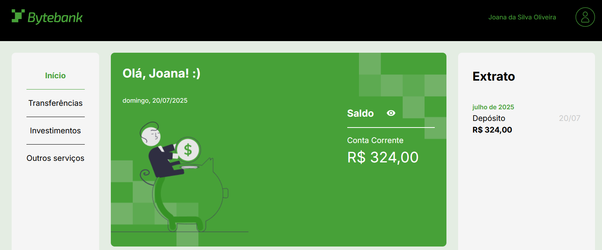
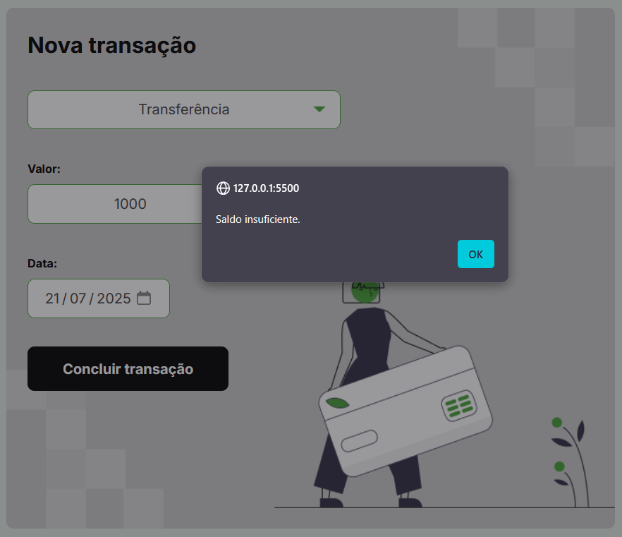

## 🏦 ByteBank

**ByteBank** é um sistema bancário fictício desenvolvido com **TypeScript**, onde é possível realizar **transações como depósito, transferência e pagamento de boletos**. Todas as transações são validadas para garantir que **não seja permitido operar sem saldo suficiente**, trazendo realismo e segurança ao fluxo financeiro.

 

## 🚀 Sobre o Projeto

Este projeto foi desenvolvido durante o curso da Alura:

* "TypeScript na prática: implemente um projeto completo com TypeScript e módulos"

Com o **ByteBank**, utilizei **TypeScript** para refatorar e aprimorar uma aplicação de banco, utilizando tipos estáticos, módulos organizados e validações para garantir a integridade das operações.

## 📚 Objetivos do Curso

* Compreender os fundamentos e conceitos do **TypeScript**;
* Aprender a **refatorar** e melhorar o projeto usando TypeScript;
* Entender a configuração e compilação do código TypeScript;
* Explorar recursos como **tipos primitivos, arrays, Type Alias e Enums**;
* Organizar e dividir o projeto em módulos eficientes.

## 🛠️ Tecnologias Utilizadas

## 🖼️ Visualização do Projeto

Uma prévia das principais funcionalidades do **ByteBank**:

**🖥️ Tela Inicial**

Dashboard com saldo da conta e histórico de transações.

**💰 Depósito e Transferência**

Formulário para realizar depósitos em conta e transferir valores.

**⚠️ Erro de Saldo Insuficiente**

Mensagem de alerta exibida quando o usuário tenta operar sem saldo suficiente.

